# 😎 Awesome Aerial-Ground Object Re-Identification

<p align="middle">
  <a href="https://awesome.re"></a>
  <a href="https://github.com/YangQiWei3/Awesome-Aerial-Ground-Object-Re-Identification/graphs/commit-activity"></a>
  <a href="http://makeapullrequest.com"></a>
  <a href="https://opensource.org/licenses/MIT"></a>
</p>

<p align="center">
  <a href="README.md">English</a> | 简体中文
</p>

<p align="center">
  <a href="leaderboards/ag_reid_leaderboards.pdf">🏆  排行榜</a>
</p>

这是一个整理 **空地目标重识别（Aerial-Ground Object Re-Identification, AG-ReID）** 相关论文、数据集、代码库和挑战赛的资源列表。  
AG-ReID 旨在跨 **空中视角** 与 **地面视角** 匹配同一目标，主要面临极端视角差异、尺度/分辨率变化、光照变化以及背景杂乱等挑战。

> 📩 欢迎通过 issue / PR 补充论文、代码或数据集。

## 📖 目录
- [😎 Awesome Aerial-Ground Object Re-Identification](#-awesome-aerial-ground-object-re-identification)
  - [📖 目录](#-目录)
  - [🌟 重点：我们的工作](#-重点我们的工作)
  - [📊 发表趋势](#-发表趋势)
  - [📝 论文与方法](#-论文与方法)
    - [基于图像的行人 AG-ReID](#基于图像的行人-ag-reid)
    - [基于图像的车辆 AG-ReID](#基于图像的车辆-ag-reid)
    - [基于视频的行人 AG-ReID](#基于视频的行人-ag-reid)
    - [挑战赛与研讨会](#挑战赛与研讨会)
  - [💾 数据集](#-数据集)
    - [更多相关探索](#更多相关探索)
  - [🤖 自动论文追踪](#-自动论文追踪)
  - [📈 Star 历史](#-star-历史)
  - [🤝 贡献指南](#-贡献指南)
  - [🤝 致谢](#-致谢)
  - [📧 联系方式](#-联系方式)
  - [📌 引用](#-引用)

---

## 🌟 重点：我们的工作

以下是我们课题组在 **跨视角对齐** 和 **鲁棒表征学习** 方向的代表性工作：

- **[ECCV 2026]** Hierarchical Hyperbolic Representation for Aerial-Ground Person Re-Identification  [论文](https://arxiv.org/abs/2607.09186) · [代码](https://github.com/YangQiWei3/HiHR)

- **[WACVW 2026]** SAS-VPReID: A Scale-Adaptive Framework with Shape Priors for Video-based Object Re-Identification at Extreme Far Distances  [论文](https://arxiv.org/pdf/2601.05535) · [代码](https://github.com/YangQiWei3/SAS-VPReID)

- **[TIP 2026]** SD-ReID: View-aware Stable Diffusion for Aerial-Ground Object Re-Identification  [论文](https://arxiv.org/abs/2504.09549)

- **[arXiv 2025]** LATex: Leveraging Attribute-based Text Knowledge for Aerial-Ground Object Re-Identification  [论文](https://arxiv.org/abs/2503.23722)

> 📩 如果你对我们的论文有任何问题，欢迎提交 issue。
---


## 📊 发表趋势
以下统计基于本仓库收录的论文自动生成。

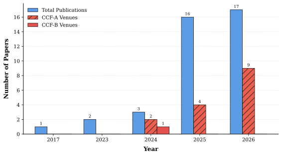

---

## 📝 论文与方法

### 基于图像的行人 AG-ReID

| 会议 / 期刊 | 方法 | 标题 | 资源 | 框架图 |
| :------------------ | :-------- | :---------------------------------------------------------------------------------------------------------------- | :-------------------------------------------------------------------------------------------------------------------------------------------------------------- | :---: |
| **CVPR 2026** | UAD | WHU-MARS: A Multispectral Aerial-Ground Benchmark Towards  Any-Scenario Person Re-Identification | [论文](https://openaccess.thecvf.com/content/CVPR2026/papers/Zhao_WHU-MARS_A_Multispectral_Aerial-Ground_Benchmark_Towards_Any-Scenario_Person_Re-Identification_CVPR_2026_paper.pdf) | 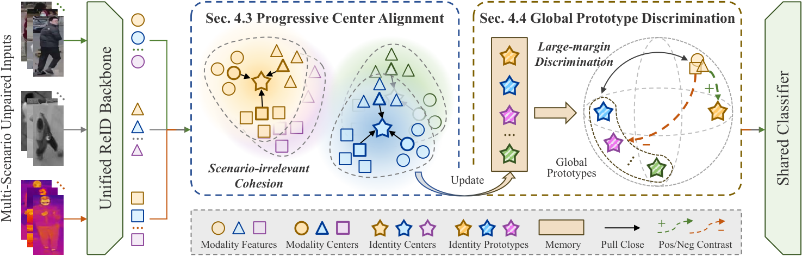<br><sub>论文原图：[ Figure 3 ](https://openaccess.thecvf.com/content/CVPR2026/papers/Zhao_WHU-MARS_A_Multispectral_Aerial-Ground_Benchmark_Towards_Any-Scenario_Person_Re-Identification_CVPR_2026_paper.pdf) · 来源：官方 PDF。<br>© 论文作者/出版方，权利归原权利人所有</sub> |
| **ECCV 2026** | MCVL | MCVL: Multi-Space Cross-View Learning for Aerial-Ground Person Re-Identification | [论文](https://media.eventhosts.cc/Conferences/ECCV2026/pdfs/7411.pdf) | 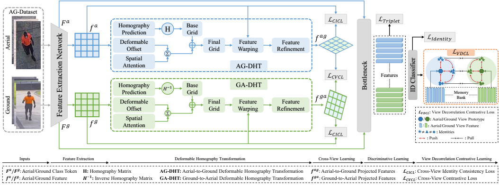<br><sub>论文原图：[ Figure 2 ](https://media.eventhosts.cc/Conferences/ECCV2026/pdfs/7411.pdf) · 来源：官方 PDF。<br>© 论文作者/出版方，权利归原权利人所有</sub> |
| **ArXiv 2026** | VR3D | VR3D: View-Robust 3D Representation Learning for Aerial-Ground Person  Re-Identification | [论文](https://arxiv.org/abs/2608.02598) | 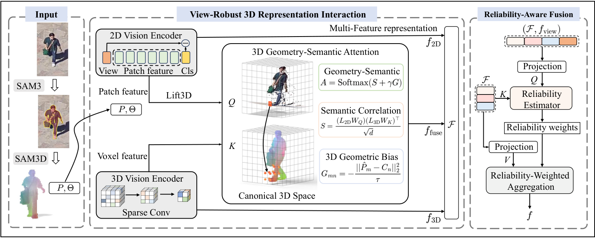<br><sub>论文原图：[ Figure 2 ](https://arxiv.org/pdf/2608.02598v1) · 来源：官方 PDF。<br>© 论文作者/出版方，权利归原权利人所有 · [许可证](https://arxiv.org/licenses/nonexclusive-distrib/1.0/license.html)</sub> |
| **ECCV 2026** | HiHR | Hierarchical Hyperbolic Representation for Aerial-Ground Person Re-Identification | [论文](https://arxiv.org/abs/2607.09186) · [代码](https://github.com/YangQiWei3/HiHR) | 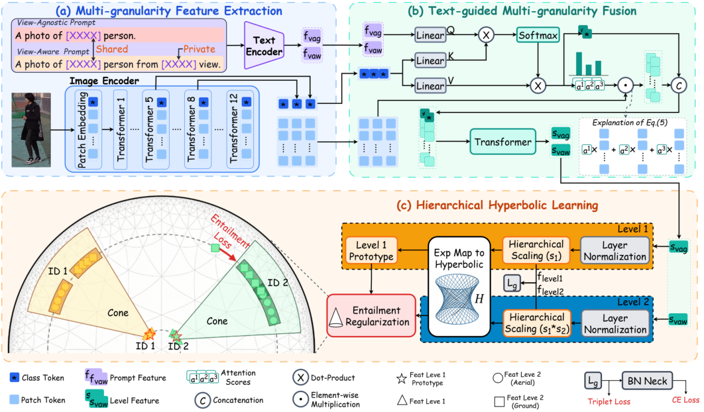<br><sub>论文原图：[ Figure 2 ](https://arxiv.org/pdf/2607.09186v1) · 来源：官方 PDF。<br>© 论文作者/出版方，权利归原权利人所有 · [许可证](https://arxiv.org/licenses/nonexclusive-distrib/1.0/license.html)</sub> |
| **ArXiv 2026** | GeoReID | Rectifying Geometry-Induced Similarity Distortions for Real-World Aerial-Ground Person Re-Identification | [论文](https://arxiv.org/abs/2601.21405) · [代码](https://github.com/kailashhambarde/GeoReID.git) | 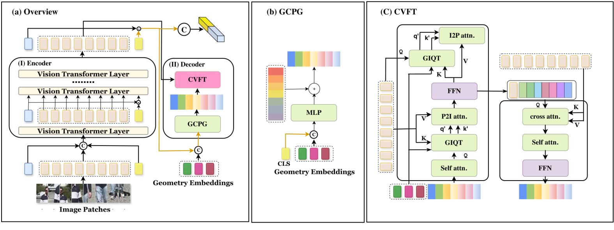<br><sub>论文原图：[ Figure 2 ](https://arxiv.org/pdf/2601.21405v1) · 来源：官方 PDF。<br>© 论文作者/出版方，权利归原权利人所有 · [许可证](https://arxiv.org/licenses/nonexclusive-distrib/1.0/license.html)</sub> |
| **ECCV 2026** | 3D-LENS | 3D-LENS: A 3D Lifting-based Elevated Novel-view Synthesis method for Single-View  Aerial-Ground Re-Identification | [论文](https://arxiv.org/abs/2604.26520) · [代码](https://github.com/TurtleSmoke/3D-LENS) | 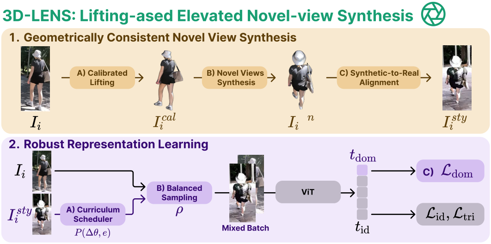<br><sub>论文原图：[ Figure 2 ](https://arxiv.org/pdf/2604.26520v1) · 来源：官方 PDF。<br>© 论文作者/出版方，权利归原权利人所有 · [许可证](https://arxiv.org/licenses/nonexclusive-distrib/1.0/license.html)</sub> |
| **CVPR 2026** | ViSA | View-Aware Semantic Alignment for Aerial-Ground Person Re-Identification | [论文](https://arxiv.org/abs/2605.18192) | 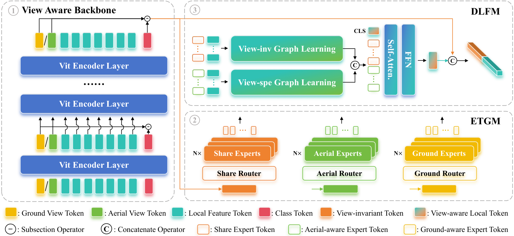<br><sub>论文原图：[ Figure 2 ](https://arxiv.org/pdf/2605.18192v1) · 来源：官方 PDF。<br>© 论文作者/出版方，权利归原权利人所有 · [许可证](https://arxiv.org/licenses/nonexclusive-distrib/1.0/license.html)</sub> |
| **CVPR 2026** | CFAN | Cross-modal Fuzzy Alignment Network for Text-Aerial Person Retrieval and A Large-scale Benchmark | [论文](https://arxiv.org/abs/2603.20721) | 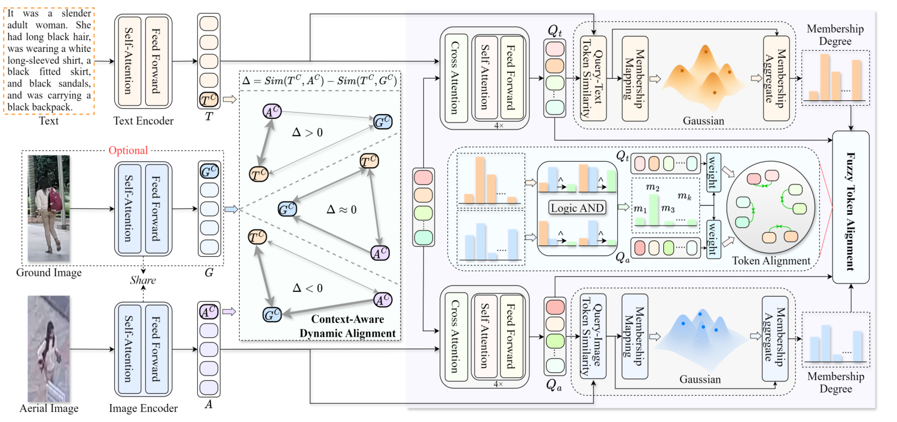<br><sub>论文原图：[ Figure 2 ](https://arxiv.org/pdf/2603.20721v1) · 来源：官方 PDF。<br>© 论文作者/出版方，权利归原权利人所有 · [许可证](https://arxiv.org/licenses/nonexclusive-distrib/1.0/license.html)</sub> |
| **PRCV 2026** | GLPSG | Global-local prompts-driven semantic guidance for aerial-ground person re-identification | [论文](https://link.springer.com/chapter/10.1007/978-981-95-5755-4_7) | 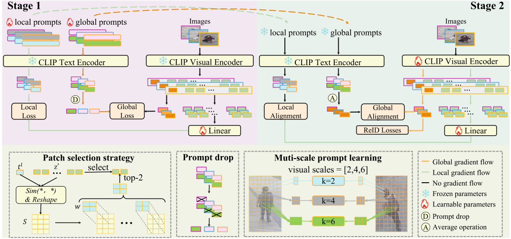<br><sub>论文原图：[ Figure 2 ](https://link.springer.com/content/pdf/10.1007/978-981-95-5755-4_7) · 来源：官方 PDF。<br>© 论文作者/出版方，权利归原权利人所有</sub> |
| **AAAI 2026** | TAG-CLIP | Text-based Aerial-Ground Object Retrieval | [论文](https://arxiv.org/pdf/2511.08369) · [代码](https://github.com/Flame-Chasers/TAG-PR) | 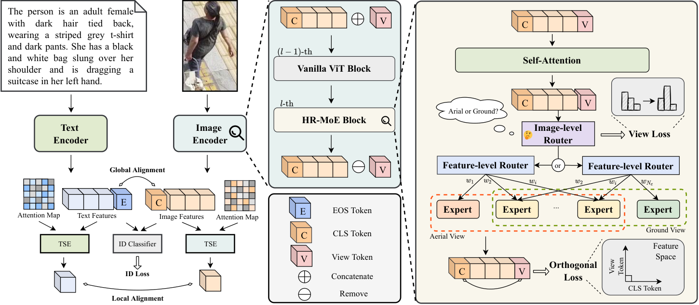<br><sub>论文原图：[ Figure 4 ](https://arxiv.org/pdf/2511.08369v1) · 来源：官方 PDF。<br>© 论文作者/出版方，权利归原权利人所有 · [许可证](https://arxiv.org/licenses/nonexclusive-distrib/1.0/license.html)</sub> |
| **AAAI 2026** | SVPR-ReID | Semantic-Driven Visual Progressive Refinement for Aerial-Ground Person ReID:  A Challenging Large-Scale Benchmark | [论文](https://ojs.aaai.org/index.php/AAAI/article/view/38339) | 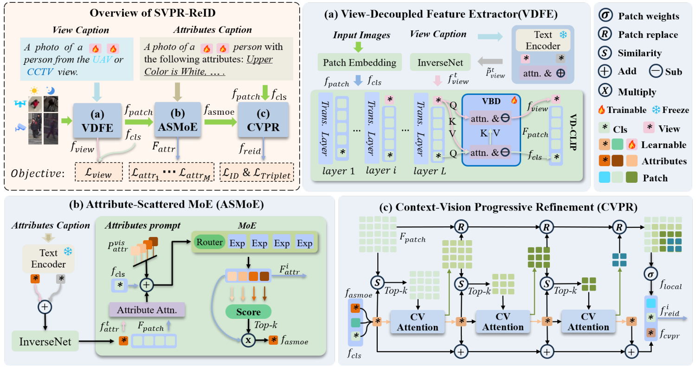<br><sub>论文原图：[ Figure 2 ](https://ojs.aaai.org/index.php/AAAI/article/download/38339/42301) · 来源：官方 PDF。<br>© 论文作者/出版方，权利归原权利人所有</sub> |
| **NeurIPS 2025** | GSAlign | Geometric and Semantic Alignment Network for Aerial-Ground Person Re-Identification | [论文](https://openreview.net/attachment?id=bxELEjg3VE&name=pdf) · [代码](https://github.com/stone96123/GSAlign?tab=readme-ov-file) | 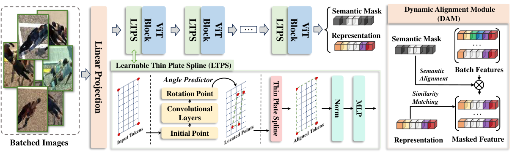<br><sub>论文原图：[ Figure 2 ](https://proceedings.neurips.cc/paper_files/paper/2025/file/86c17de05579cde52025f9984e6e2ebb-Paper-Conference.pdf) · 来源：官方 PDF。<br>© 论文作者/出版方，权利归原权利人所有</sub> |
| **ICCV 2025** | VIF | Bridging the Sky and Ground: Towards View-Invariant Feature Learning for Aerial-Ground Person Re-Identification | [论文](https://openaccess.thecvf.com/content/ICCV2025/html/Khalid_Bridging_the_Sky_and_Ground_Towards_View-Invariant_Feature_Learning_for_ICCV_2025_paper.html) | 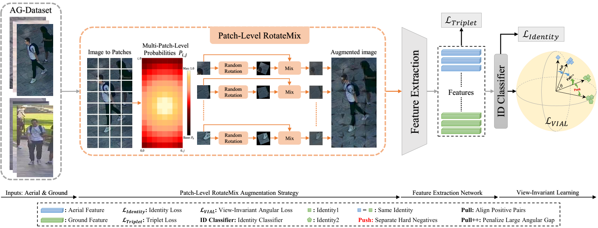<br><sub>论文原图：[ Figure 2 ](https://openaccess.thecvf.com/content/ICCV2025/papers/Khalid_Bridging_the_Sky_and_Ground_Towards_View-Invariant_Feature_Learning_for_ICCV_2025_paper.pdf) · 来源：官方 PDF。<br>© 论文作者/出版方，权利归原权利人所有</sub> |
| **TIP 2026** | SD-ReID | View-aware Stable Diffusion for Aerial-Ground Person Re-Identification | [论文](https://arxiv.org/abs/2504.09549) · [代码](https://github.com/924973292/SD-ReID) | 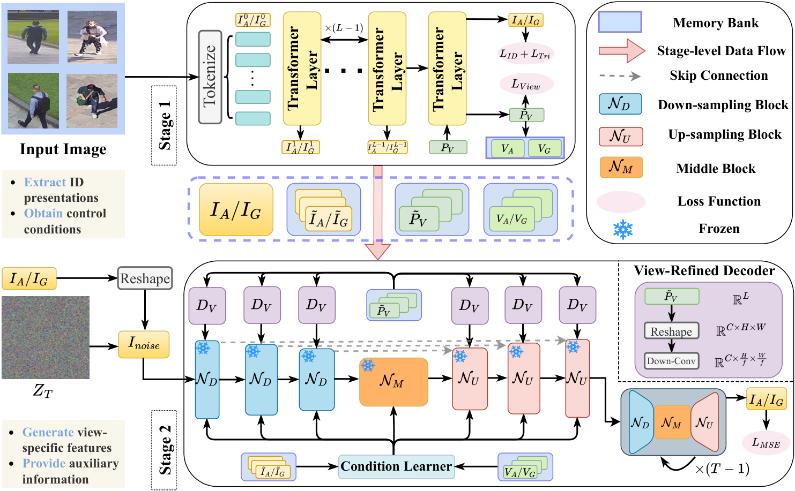<br><sub>论文原图：[ Figure 2 ](https://arxiv.org/pdf/2504.09549v1) · 来源：官方 PDF。<br>© 论文作者/出版方，权利归原权利人所有 · [许可证](https://arxiv.org/licenses/nonexclusive-distrib/1.0/license.html)</sub> |
| **ArXiv 2025** | LATex | Leveraging Attribute-based Text Knowledge for Aerial-Ground Person Re-Identification | [论文](https://arxiv.org/abs/2503.23722) | 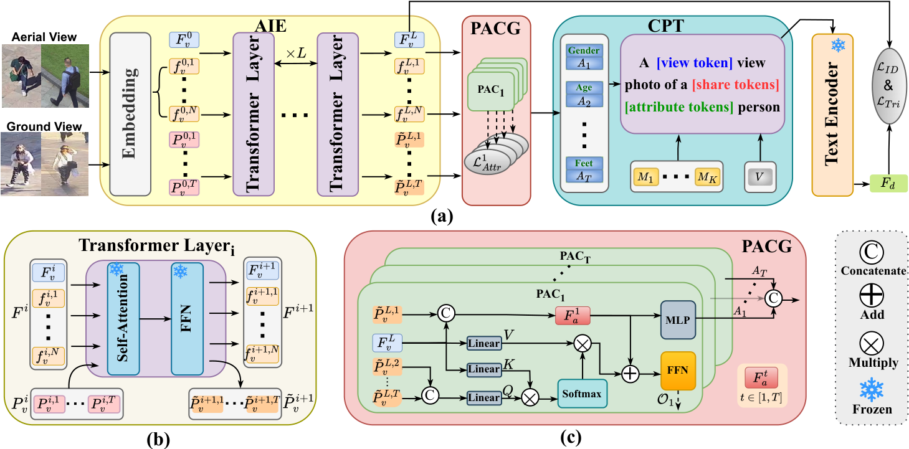<br><sub>论文原图：[ Figure 3 ](https://arxiv.org/pdf/2503.23722v1) · 来源：官方 PDF。<br>© 论文作者/出版方，权利归原权利人所有 · [许可证](https://arxiv.org/licenses/nonexclusive-distrib/1.0/license.html)</sub> |
| **ICME 2025** | DTST | Dynamic Token Selective Transformer for  Aerial-Ground Person Re-Identification | [论文](https://yuhaiw.github.io/DTS-AGPReID/ICMEYuhai.pdf) · [代码](https://github.com/YuhaiW/reidselecttoken) | 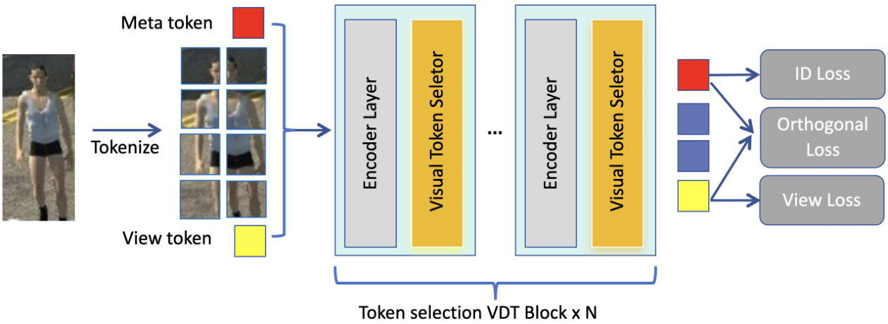<br><sub>论文原图：[ Figure 2 ](https://yuhaiw.github.io/DTS-AGPReID/ICMEYuhai.pdf) · 来源：官方 PDF。<br>© 论文作者/出版方，权利归原权利人所有</sub> |
| **CVPR 2025** | SeCap | Self-Calibrating and Adaptive Prompts for Cross-view Person Re-Identification in Aerial-Ground Networks | [论文](https://arxiv.org/abs/2503.06965) · [代码](https://github.com/wangshining681/SeCap-AGPReID) | 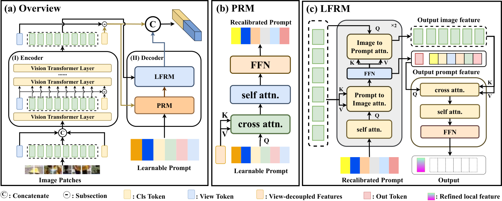<br><sub>论文原图：[ Figure 2 ](https://arxiv.org/pdf/2503.06965v1) · 来源：官方 PDF。<br>© 论文作者/出版方，权利归原权利人所有 · [许可证](https://arxiv.org/licenses/nonexclusive-distrib/1.0/license.html)</sub> |
| **TOMM 2025** | CVAF | A CLIP-Based View-Consistent Alignment Framework for Aerial-Ground Person Re-Identification | [论文](https://dl.acm.org/doi/pdf/10.1145/3785482) | 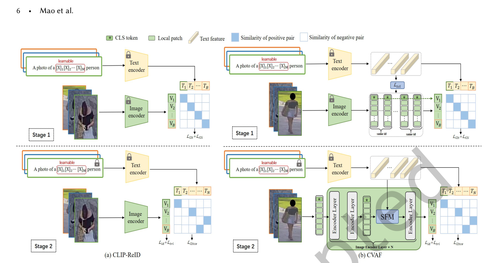<br><sub>论文原图：[ Figure 2 ](https://dl.acm.org/doi/pdf/10.1145/3785482) · 来源：官方 PDF。<br>© 论文作者/出版方，权利归原权利人所有</sub> |
| **ICIG 2025** | PDPA | Perspective Driven Prototype Alignment for Aerial-Ground Person Re-identification | [论文](https://link.springer.com/chapter/10.1007/978-981-95-3393-0_42) | 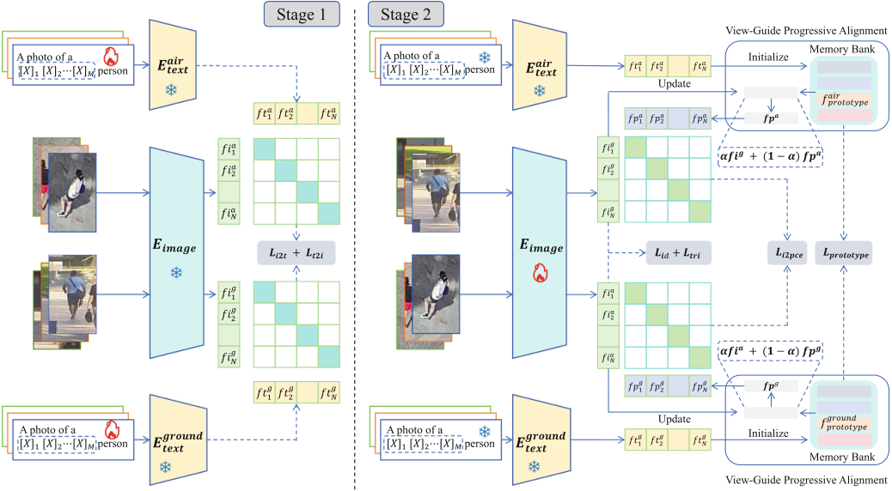<br><sub>论文原图：[ Figure 2 ](https://link.springer.com/content/pdf/10.1007/978-981-95-3393-0_42) · 来源：官方 PDF。<br>© 论文作者/出版方，权利归原权利人所有</sub> |
| **Drones 2025** | UAGRPG | Unsupervised Aerial-Ground Re-Identification from Pedestrian to Group for UAV-Based Surveillance | [论文](https://www.mdpi.com/2504-446X/9/4/244) | 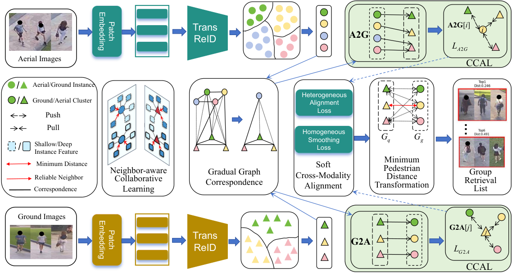<br><sub>论文原图：[ Figure 2 ](https://mdpi-res.com/d_attachment/drones/drones-09-00244/article_deploy/drones-09-00244-v2.pdf) · 来源：官方 PDF。<br>© 论文作者/出版方，权利归原权利人所有 · [许可证](https://creativecommons.org/licenses/by/4.0/)</sub> |
| **自动化学报 2025** | — | Implicit Decoder Alignment for Aerial-ground Person Re-identification | [论文](https://www.aas.net.cn/cn/article/doi/10.16383/j.aas.c240705) | 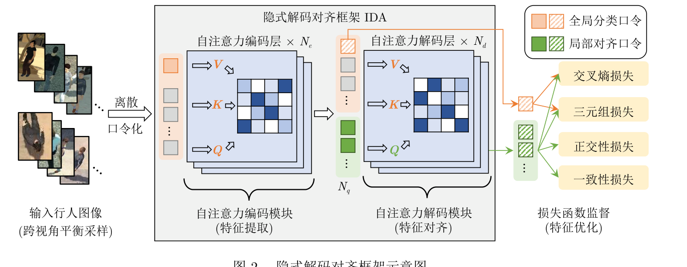<br><sub>论文原图：[ Figure 2 ](https://www.aas.net.cn/cn/article/pdf/preview/10.16383/j.aas.c240705.pdf) · 来源：官方 PDF。<br>© 论文作者/出版方，权利归原权利人所有</sub> |
| **CVPR 2024** | VDT | View-decoupled Transformer for Person Re-identification under Aerial-ground Camera Network | [论文](https://arxiv.org/abs/2403.14513) · [代码](https://github.com/LinlyAC/VDT-AGPReID?tab=readme-ov-file) | 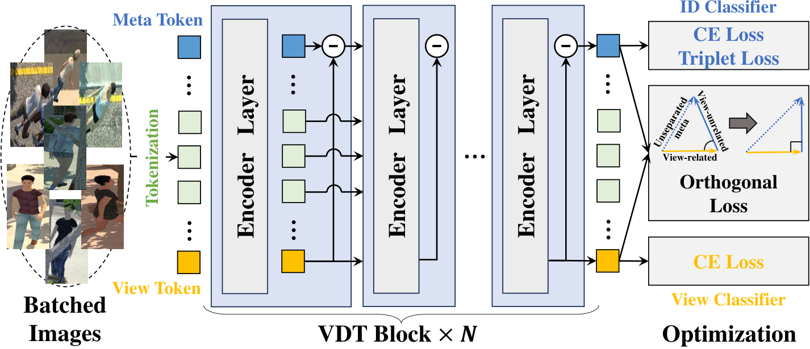<br><sub>论文原图：[ Figure 2 ](https://arxiv.org/pdf/2403.14513v1) · 来源：官方 PDF。<br>© 论文作者/出版方，权利归原权利人所有 · [许可证](https://arxiv.org/licenses/nonexclusive-distrib/1.0/license.html)</sub> |
| **TITS 2024** | V2E | Bridging Aerial and Ground Views for Person Re-identification | [论文](https://arxiv.org/abs/2401.02634) · [代码](https://github.com/huynguyen792/AG-ReID.v2) | 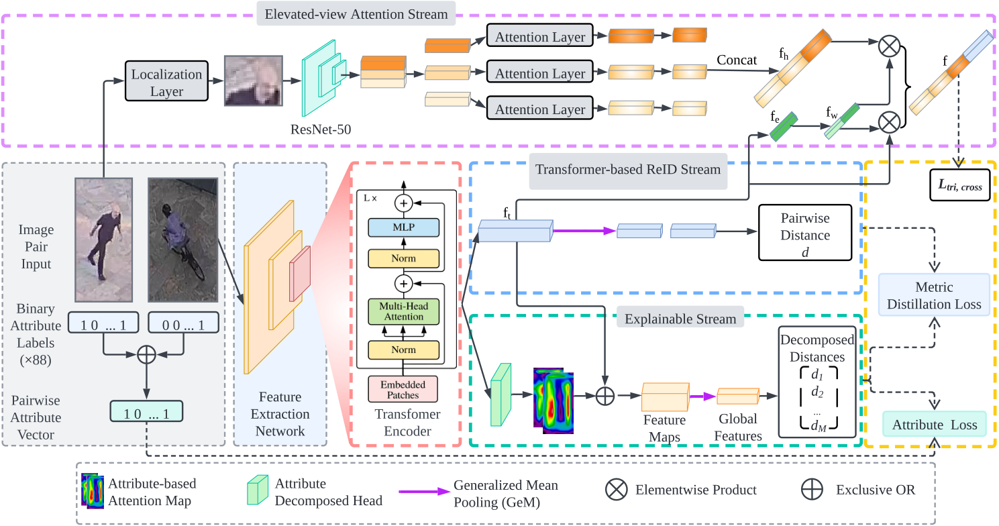<br><sub>论文原图：[ Figure 9 ](https://arxiv.org/pdf/2401.02634v1) · 来源：官方 PDF。<br>© 论文作者/出版方，权利归原权利人所有 · [许可证](https://arxiv.org/licenses/nonexclusive-distrib/1.0/license.html)</sub> |
| **ICME 2023** | Explain | Aerial-Ground Person Re-ID | [论文](https://arxiv.org/abs/2303.08597) | 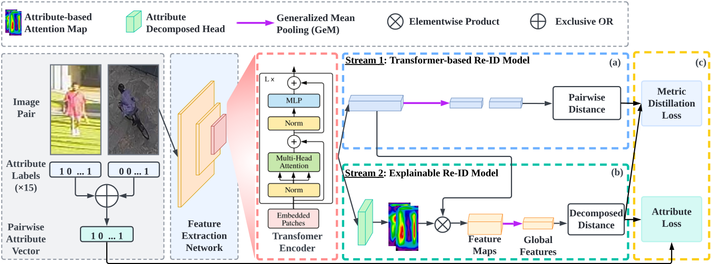<br><sub>论文原图：[ Figure 4 ](https://arxiv.org/pdf/2303.08597v1) · 来源：官方 PDF。<br>© 论文作者/出版方，权利归原权利人所有 · [许可证](https://arxiv.org/licenses/nonexclusive-distrib/1.0/license.html)</sub> |
| **ATR 2017** | — | Person Re-Identification Across Aerial and Ground-Based Cameras by Deep Feature Fusion | [论文](https://publica.fraunhofer.de/bitstreams/ef904224-f31f-484d-b8d2-56695e46779c/download) | 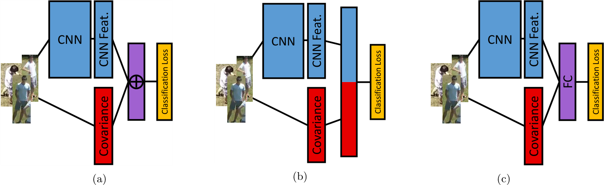<br><sub>论文原图：[ Figure 2 ](https://publica.fraunhofer.de/bitstreams/ef904224-f31f-484d-b8d2-56695e46779c/download) · 来源：官方 PDF。<br>© 论文作者/出版方，权利归原权利人所有</sub> |

### 基于图像的车辆 AG-ReID

| 会议 / 期刊 | 方法 | 标题 | 资源 | 框架图 |
| :--------------- | :---- | :----------------------------------------------------------------------------------- | :------------------------------------------------ | :---: |
| **SENSORS 2025** | CVNet | Lightweight Cross-View Vehicle ReID with Multi-Scale Localization | [论文](https://www.mdpi.com/1424-8220/25/9/2809) | 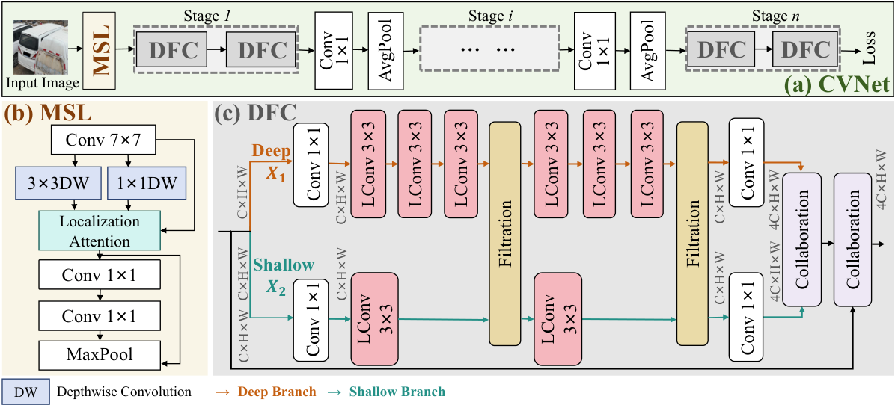<br><sub>论文原图：[ Figure 3 ](https://mdpi-res.com/d_attachment/sensors/sensors-25-02809/article_deploy/sensors-25-02809-v2.pdf) · 来源：官方 PDF。<br>© 论文作者/出版方，权利归原权利人所有 · [许可证](https://creativecommons.org/licenses/by/4.0/)</sub> |
| **RS 2025** | AGID | Aerial-Ground Cross-View Vehicle Re-Identification: A Benchmark Dataset and Baseline | [论文](https://www.mdpi.com/2072-4292/17/15/2653) | 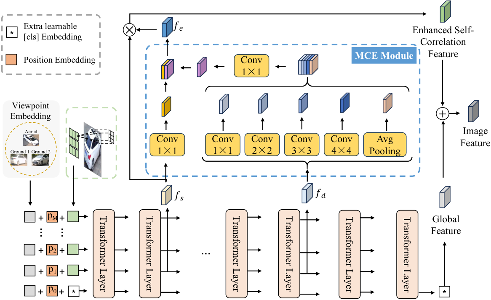<br><sub>论文原图：[ Figure 4 ](https://mdpi-res.com/d_attachment/remotesensing/remotesensing-17-02653/article_deploy/remotesensing-17-02653-v2.pdf) · 来源：官方 PDF。<br>© 论文作者/出版方，权利归原权利人所有 · [许可证](https://creativecommons.org/licenses/by/4.0/)</sub> |

### 基于视频的行人 AG-ReID

| 会议 / 期刊 | 方法 | 标题 | 资源 | 框架图 |
| :------------- | :--------- | :-------------------------------------------------------------------------------------------------------------------------------- | :------------------------------------------------------------------------------------------------------------------------------------------------------------------------------------------------------------------ | :---: |
| **WACVW 2026** | SAS-VPReID | A Scale-Adaptive Framework with Shape Priors for Video-based Person Re-Identification at Extreme Far Distances | [论文](https://arxiv.org/pdf/2601.05535) · [代码](https://github.com/YangQiWei3/SAS-VPReID) | 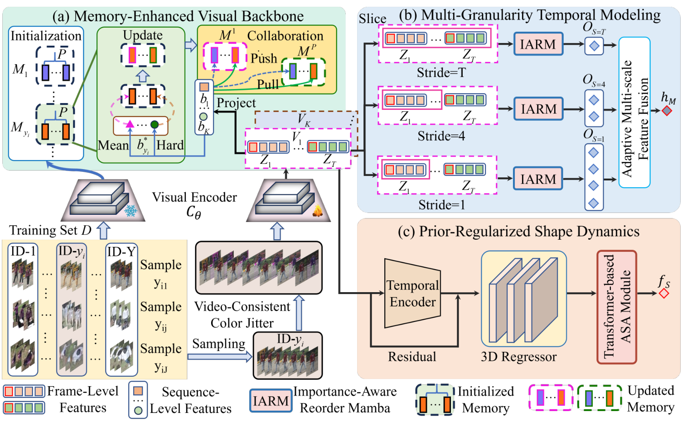<br><sub>论文原图：[ Figure 2 ](https://arxiv.org/pdf/2601.05535v1) · 来源：官方 PDF。<br>© 论文作者/出版方，权利归原权利人所有 · [许可证](https://arxiv.org/licenses/nonexclusive-distrib/1.0/license.html)</sub> |
| **WACVW 2026** | S3-CLIP | Video Super Resolution for Person-ReID | [论文](https://arxiv.org/abs/2601.08807) · [代码](https://github.com/TomasDelaney/S3-CLIP) | 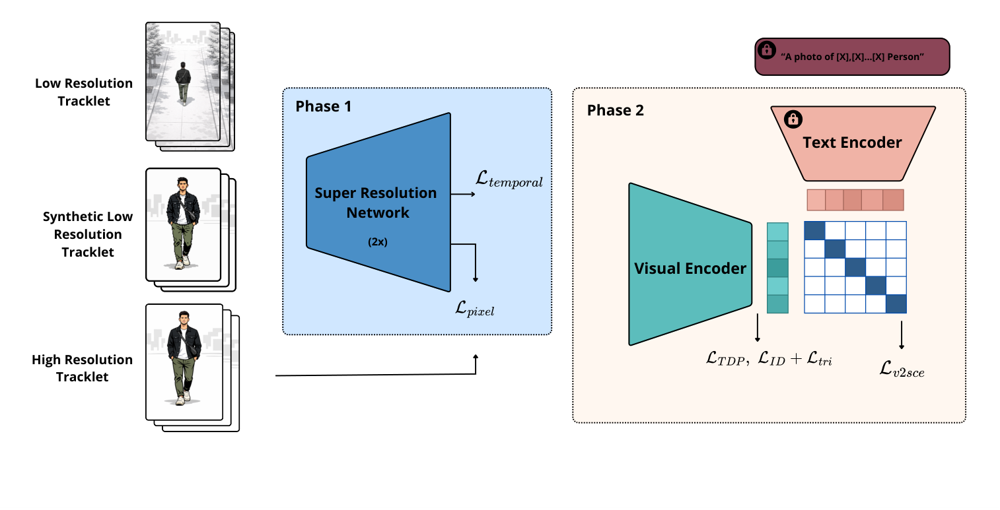<br><sub>论文原图：[ Figure 1 ](https://arxiv.org/pdf/2601.08807v1) · 来源：官方 PDF。<br>© 论文作者/出版方，权利归原权利人所有 · [许可证](https://arxiv.org/licenses/nonexclusive-distrib/1.0/license.html)</sub> |
| **WACVW 2026** | EAGLE-ReID | Strategic alignment and delta consistency for extreme far-distance aerial-ground re-identification | [论文](https://openaccess.thecvf.com/content/WACV2026W/VReID-XFD/html/Kang_EAGLE-ReID_Strategic_Alignment_and_Delta_Consistency_for_Extreme_Far-Distance_Aerial-Ground_WACVW_2026_paper.html) | 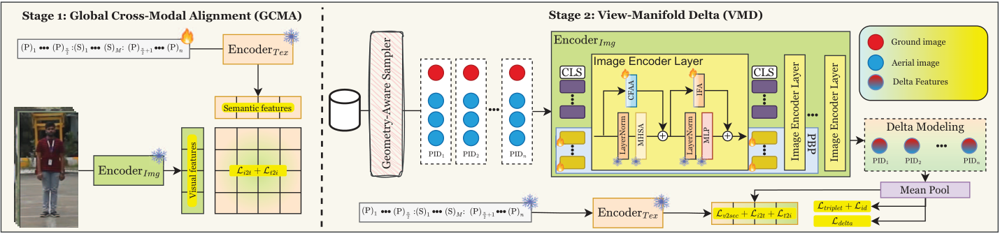<br><sub>论文原图：[ Figure 3 ](https://openaccess.thecvf.com/content/WACV2026W/VReID-XFD/papers/Kang_EAGLE-ReID_Strategic_Alignment_and_Delta_Consistency_for_Extreme_Far-Distance_Aerial-Ground_WACVW_2026_paper.pdf) · 来源：官方 PDF。<br>© 论文作者/出版方，权利归原权利人所有</sub> |
| **WACVW 2026** | — | Enhancing Aerial–Ground Video Person Re-Identification via DFGS-Guided  CLIP Sampling and Inference-Time Uncertainty-Aware Fusion | [论文](https://scholar.google.com/scholar?hl=zh-CN&as_sdt=0%2C45&q=Enhancing+Aerial%E2%80%93Ground+Video+Person+Re-Identification+via+DFGS-Guided++CLIP+Sampling+and+Inference-Time+Uncertainty-Aware+Fusion&btnG=) | 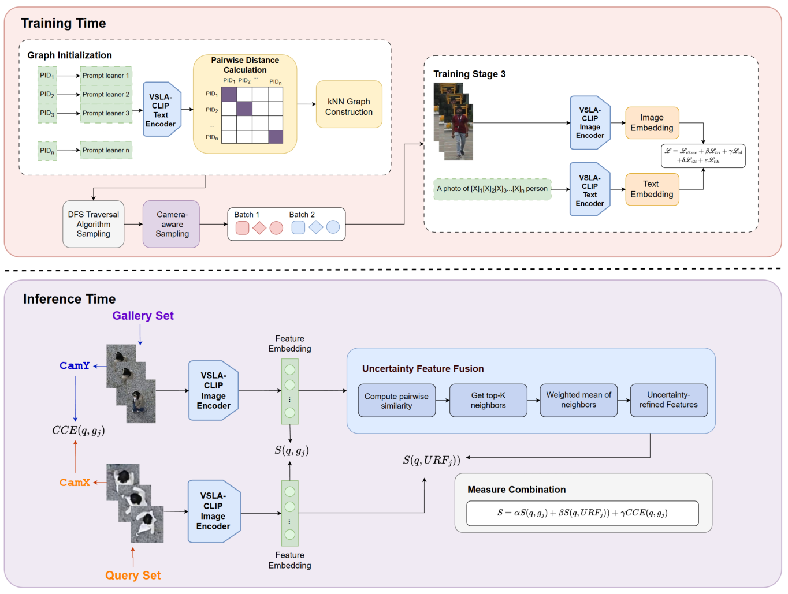<br><sub>论文原图：[ Figure 1 ](https://openaccess.thecvf.com/content/WACV2026W/VReID-XFD/papers/Nguyen_Enhancing_Aerial-Ground_Video_Person_Re-Identification_via_DFGS-Guided_CLIP_Sampling_and_WACVW_2026_paper.pdf) · 来源：官方 PDF。<br>© 论文作者/出版方，权利归原权利人所有</sub> |
| **CVPR 2025** | AG-VPReID | A Challenging Large-Scale Benchmark for Aerial-Ground Video-based Person Re-Identification | [论文](https://arxiv.org/abs/2503.08121) | 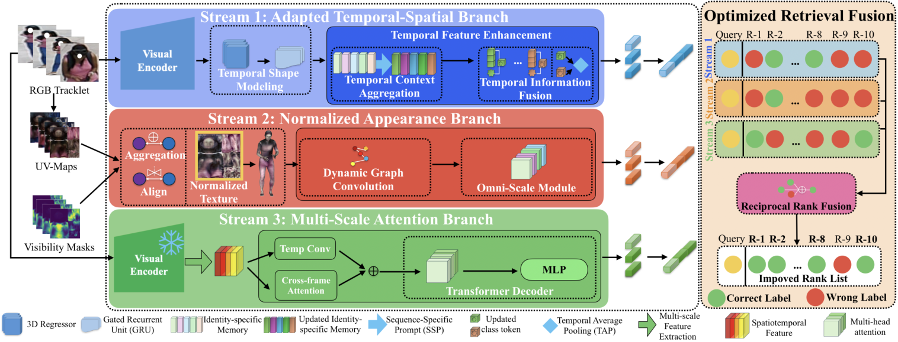<br><sub>论文原图：[ Figure 3 ](https://arxiv.org/pdf/2503.08121v1) · 来源：官方 PDF。<br>© 论文作者/出版方，权利归原权利人所有 · [许可证](https://arxiv.org/licenses/nonexclusive-distrib/1.0/license.html)</sub> |
| **IJCB 2025** | VM-TAPS | View-specific Memory with Temporal and Scale Awareness Framework for Video-based Cross-View Person Re-Identification | [论文](https://www.di.ubi.pt/%7Ehugomcp/doc/rashid_ijcb2025.pdf) · [代码](https://github.com/MdRashidunnabi/VM-TAPS) | 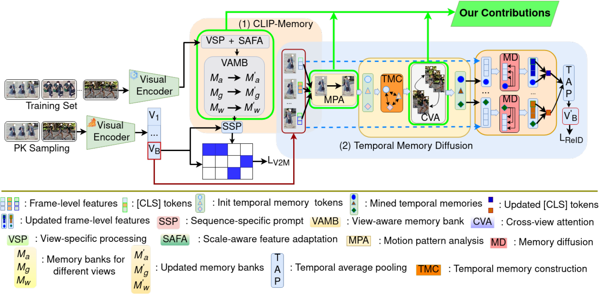<br><sub>论文原图：[ Figure 2 ](https://www.di.ubi.pt/~hugomcp/doc/rashid_ijcb2025.pdf) · 来源：官方 PDF。<br>© 论文作者/出版方，权利归原权利人所有</sub> |
| **TBIOM 2025** | DetReIDX | A Stress-Test Dataset for Real-World UAV-Based Person Recognition | [论文](https://arxiv.org/pdf/2505.04793) | 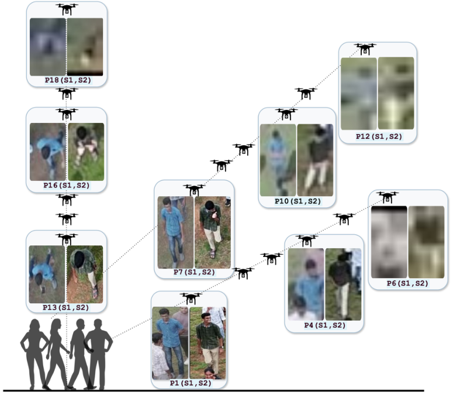<br><sub>论文原图：[ Figure 5 ](https://arxiv.org/pdf/2505.04793v1) · 来源：官方 PDF。<br>© 论文作者/出版方，权利归原权利人所有 · [许可证](https://arxiv.org/licenses/nonexclusive-distrib/1.0/license.html)</sub> |
| **TBIOM 2025** | MTF–CVReID | Seeing Across Time and Views: Multi-Temporal Cross-View Learning for Robust Video Person Re-Identification | [论文](https://arxiv.org/pdf/2511.02564) · [代码](https://github.com/MdRashidunnabi/MTF-CVReID) | 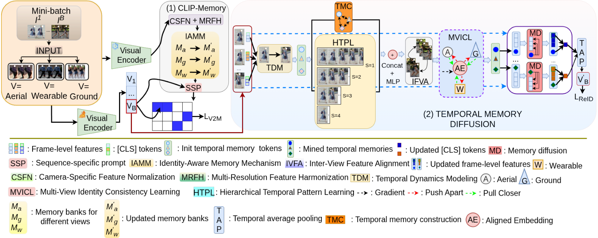<br><sub>论文原图：[ Figure 2 ](https://arxiv.org/pdf/2511.02564v1) · 来源：官方 PDF。<br>© 论文作者/出版方，权利归原权利人所有 · [许可证](https://arxiv.org/licenses/nonexclusive-distrib/1.0/license.html)</sub> |
| **ECCV 2024** | — | Cross-Platform Video Person ReID: A New Benchmark Dataset and Adaptation Approach | [论文](https://arxiv.org/abs/2408.07500) · [代码](https://github.com/FHR-L/VSLA-CLIP) | 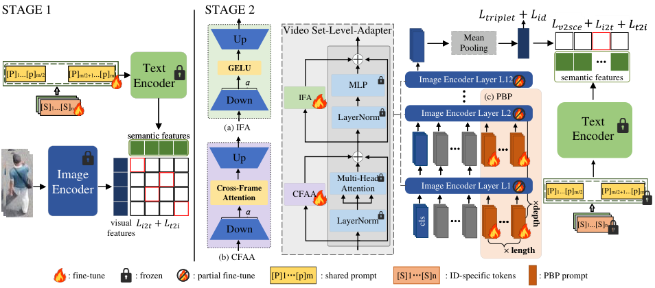<br><sub>论文原图：[ Figure 3 ](https://arxiv.org/pdf/2408.07500v1) · 来源：官方 PDF。<br>© 论文作者/出版方，权利归原权利人所有 · [许可证](https://arxiv.org/licenses/nonexclusive-distrib/1.0/license.html)</sub> |

---

### 挑战赛与研讨会

| 会议 / 期刊   | 标题                                                                                      | 资源                                                                                |
| :------------ | :---------------------------------------------------------------------------------------- | :---------------------------------------------------------------------------------- |
| **WACV 2026** | VReID-XFD: Video-based Object Re-identification at Extreme Far Distance Challenge Results | [论文](https://arxiv.org/pdf/2601.01312v1)                                          |
| **IJCB 2025** | AG-VPReID 2025: Aerial-Ground Video-based Object Re-identification Challenge Results      | [论文](https://arxiv.org/pdf/2506.22843)                                            |
| **IJCB 2023** | AG-ReID 2023: Aerial-Ground Object Re-identification Challenge Results                    | [论文](https://cvlab.cse.msu.edu/pdfs/IJCB_AG_ReID2023_Challenge_Summary_Paper.pdf) |

---


## 💾 数据集

以下统计来自各数据集论文；A/G/W 分别表示空中、地面和可穿戴相机。

| 数据集 | 来源 | ID 数 | 图像数 | 数据来源 | 场景 | 相机 | 属性 | 文本描述 | 光照 | 跨时间 | 季节 | 高度 | 下载 |
| :--- | :--- | :--- | :--- | :--- | :--- | :--- | :--- | :--- | :--- | :--- | :--- | :--- | :--- |
| **AG-ReID** | ICME 2023 | 388 | 21983 | real | 1 | 2 (1A+1G) | 15 | × | Day | × | Spring, Summer | 15–45 m | [链接](https://drive.google.com/file/d/1hzieEPlXfjkN3V3XWqI5rAwpF_sCF1K9/view) |
| **AG-ReID.v2** | TITS 2024 | 1615 | 100502 | real | 1 | 3 (1A+1G+1W) | 15 | × | Day | × | Spring, Summer | 1.5 m, 3 m, 15–45 m | [链接](https://drive.google.com/drive/folders/16r7G_CuUqfWG6_UCT7goIGRMqJird6vK) |
| **CARGO** | CVPR 2024 | 5000 | 108563 | synthetic | 1 | 13 (5A+8G) | 0 | × | Day & Night | × | Virtual Summer | 5–75 m | [链接](https://drive.google.com/file/d/1yDjyH0VtW7efxP3vgQjIqTx2oafCB67t/view) |
| **G2APS-ReID** | CVPR 2025 | 2788 | 200864 | real | 1 | 2 (1A+1G) | 0 | × | Day or Night | × | Summer | 20–60 m | [链接](https://pan.baidu.com/share/init?surl=MRrhqoQzwxw7qOx4Lqdl2g) |
| **LAGPeR** | CVPR 2025 | 4231 | 63842 | real | 7 | 21 (7A+14G) | 0 | × | Day or Night | × | Summer | 20–60 m | [链接](https://pan.baidu.com/share/init?surl=MRrhqoQzwxw7qOx4Lqdl2g) |
| **CP2108** | AAAI 2026 | 2108 | 142817 | real | 8 | 39 (17A+22G) | 22 | ✓ | Day & Night | ✓ | All Year | 2 m, 15–60 m | [链接](https://github.com/ahu-xhao/SVPR-ReID) |

#### 其他相关数据集

| 数据集 | 来源 | 类别 | 下载 |
| :--- | :--- | :--- | :--- |
| **MOO** | ArXiv 2026 | Image.Animal | [链接](https://github.com/TurtleSmoke/MOO) |
| **AG-VPReID** | CVPR 2025 | Video.Person | [链接](https://drive.google.com/drive/folders/1wtdhKzK9Fbj7xkGAM84KNJ1uYCxSMHdj) |
| **DetReIDX** | TBIOM 2025 | Video.Person | [链接](https://github.com/kailashhambarde/DetReIDX/tree/main) |

### 当前 SOTA（前五个公开基准）

截至 **2026-10-02**，下表按各论文报告的标准协议汇总；每个协议按最高报告 mAP 选择方法，数值为该方法的 **mAP / Rank-1（%）**（Rank-1 不一定是该列单项最高），结果未独立复现。

| 数据集 | 方法 | 标准协议结果（mAP / Rank-1） | 来源 |
| :--- | :--- | :--- | :--- |
| **AG-ReID** | GLPSG | A→G: 81.50 / 87.70; G→A: 84.30 / 90.60 | [GLPSG](https://link.springer.com/chapter/10.1007/978-981-95-5755-4_7) |
| **AG-ReID.v2** | HiHR; CVAF | A→C: 84.04 / 88.84 (HiHR); C→A: 83.21 / 88.57 (HiHR); A→W: 87.81 / 92.49 (CVAF); W→A: 85.08 / 90.85 (CVAF) | [HiHR](https://arxiv.org/abs/2607.09186) · [CVAF](https://dl.acm.org/doi/10.1145/3785482) |
| **CARGO** | HiHR; MCVL; ViSA | ALL: 67.52 / 74.36 (HiHR); A→G: 70.53 / 75.53 (HiHR); A→A: 72.41 / 82.50 (MCVL); G→G: 83.90 / 88.39 (ViSA) | [HiHR](https://arxiv.org/abs/2607.09186) · [MCVL](https://media.eventhosts.cc/Conferences/ECCV2026/pdfs/7411.pdf) · [ViSA](https://arxiv.org/abs/2605.18192) |
| **G2APS-ReID** | MCVL | A→G: 62.95 / 78.87; G→A: 59.70 / 74.50 | [MCVL](https://media.eventhosts.cc/Conferences/ECCV2026/pdfs/7411.pdf) |
| **LAGPeR** | HiHR | A→G: 33.80 / 46.95; G→A: 36.74 / 39.30; G→A+G: 23.99 / 31.39 | [HiHR](https://arxiv.org/abs/2607.09186) |

---

### 更多相关探索

| 会议 / 期刊     | 标题                                                                                                                    | 资源                                                                                                                                                                                        |
| :-------------- | :---------------------------------------------------------------------------------------------------------------------- | :------------------------------------------------------------------------------------------------------------------------------------------------------------------------------------------ |
| **ArXiv 2025**  | Multi-modal Multi-platform Person Re-Identification: Benchmark and Method                                               | [论文](https://arxiv.org/pdf/2503.17096) · [代码](https://github.com/MP-ReID/mp-reid) · [数据集](https://drive.google.com/file/d/1hImLEMcsBB2kNV4McGyksVAumLjZQoUU/view)                    |
| **TCSVT 2025**  | AEA-FIRM: Adaptive Elastic Alignment with Fine-Grained Representation Mining for Text-based Aerial Pedestrian Retrieval | [论文](https://ieeexplore.ieee.org/document/11072214) · [代码](https://github.com/xbdxwyh/AEA-FIRM-main) · [数据集](https://drive.google.com/file/d/1YYIpBDoJzTIwYRlpWUqEHmpo5GK05S_W/view) |
| **IJCB 2025**   | AG-VPReID.VIR: Bridging Aerial and Ground Platforms for Video-based Visible-Infrared Person Re-ID                       | [论文](https://arxiv.org/abs/2507.17995) · [数据集](https://drive.google.com/drive/folders/1Iy814PqWjwIZcv6CZpieFju-Dop9Y2G7)                                                               |
| **SPL 2025**    | Omni-Directional View Person Re-Identification Through 3D Human Reconstruction                                          | [论文](https://ieeexplore.ieee.org/stamp/stamp.jsp?tp=&arnumber=10839551)                                                                                                                   |
| **ACM MM 2024** | AerialGait: Bridging Aerial and Ground Views for Gait Recognition                                                       | [论文](https://dl.acm.org/doi/pdf/10.1145/3664647.3681002)                                                                                                                                  |

---

## 🤖 自动论文追踪

本仓库可每周检索 arXiv、OpenAlex、Crossref 和 DBLP，跨数据源去重后创建滚动审核 Issue。检索结果**不会自动进入正式清单**；人工确认后，可通过手动 workflow 创建同时更新中英文 README 的 Pull Request。

请参阅[配置与审核说明](docs/PAPER_TRACKER.zh-CN.md)。

---

## 📈 Star 历史
<picture>
  <source media="(prefers-color-scheme: dark)"
    srcset="https://api.star-history.com/svg?repos=YangQiWei3/Awesome-Aerial-Ground-Object-Re-Identification&type=Date&theme=dark" />
  <source media="(prefers-color-scheme: light)"
    srcset="https://api.star-history.com/svg?repos=YangQiWei3/Awesome-Aerial-Ground-Object-Re-Identification&type=Date" />
  
</picture>


---

## 🤝 贡献指南

欢迎提交 PR / Issue！请遵循以下规则：

1. 将条目添加到正确的部分（论文 / 挑战赛 / 数据集）。
2. 表格按 **年份降序** 排列，同一年份内按 **会议/期刊** 排列。
3. 格式要求：

   * 会议/期刊使用 **粗体**（例如 `**CVPR 2025**`）
   * 方法未知时使用 `—`
   * 资源顺序：`论文 · 代码 · 数据集 · 项目主页`（仅包含可用链接）
   * 核心论文必须使用固定版本官方 PDF 中的作者原图：补充 `data/frameworks.json`，运行 `python scripts/extract_frameworks.py PAPER_ID` 裁图，再运行 `python scripts/update_readmes.py` 同步中英文 README。
   * 只允许裁掉页面空白；不得重绘、改色、增加标注，也不得使用第三方重制图或 AI 生成图。

**模板**

```markdown
| **VENUE YEAR** | Method | Paper Title | [论文](link) · [代码](link) · [数据集](link) · [项目主页](link) | 作者原始 Figure |
```


---

## 🤝 致谢

我们诚挚感谢学术社区以及所有推动空地目标重识别领域发展的研究者。

## 📧 联系方式

欢迎提出问题、建议或合作意向：

- **Email**: [dutyqw@mail.dlut.edu.cn](mailto:dutyqw@mail.dlut.edu.cn)
- **GitHub**: [Yang Qiwei](https://github.com/YangQiWei3)

## 📌 引用

如果我们的工作或本仓库对你的研究有帮助，欢迎引用：

```bibtex
@misc{yang2026hihr,
  title         = {HiHR: Hierarchical Hyperbolic Representation for Aerial-Ground Person Re-Identification},
  author        = {Qiwei Yang and Pingping Zhang},
  year          = {2026},
  eprint        = {2607.09186},
  archiveprefix = {arXiv},
  primaryclass  = {cs.CV},
  url           = {https://arxiv.org/abs/2607.09186}
}

@article{yang2026sas,
  title={SAS-VPReID: A Scale-Adaptive Framework with Shape Priors for Video-based Person Re-Identification at Extreme Far Distances},
  author={Yang, Qiwei and Zhang, Pingping and Wang, Yuhao and Gong, Zijing},
  journal={arXiv preprint arXiv:2601.05535},
  year={2026}
}

@article{wang2025sd,
  title={SD-ReID: View-aware Stable Diffusion for Aerial-Ground Person Re-Identification},
  author={Wang, Yuhao and Hu, Xiang and Wang, Lixin and Zhang, Pingping and Lu, Huchuan},
  journal={arXiv preprint arXiv:2504.09549},
  year={2025}
}

@article{zhang2025latex,
  title={Latex: Leveraging attribute-based text knowledge for aerial-ground person re-identification},
  author={Zhang, Pingping and Hu, Xiang and Wang, Yuhao and Lu, Huchuan},
  journal={arXiv preprint arXiv:2503.23722},
  year={2025}
}

@misc{awesome_agpreid,
  title        = {Awesome Aerial-Ground Object Re-Identification},
  author       = {Yang, Qiwei, Zhang, Pingping and Gong, Zijing},
  howpublished = {\url{https://github.com/YangQiWei3/Awesome-Aerial-Ground-Object-Re-Identification}},
  year         = {2026},
  note         = {A curated list of papers, datasets, and resources for AGPReID.}
}
```
